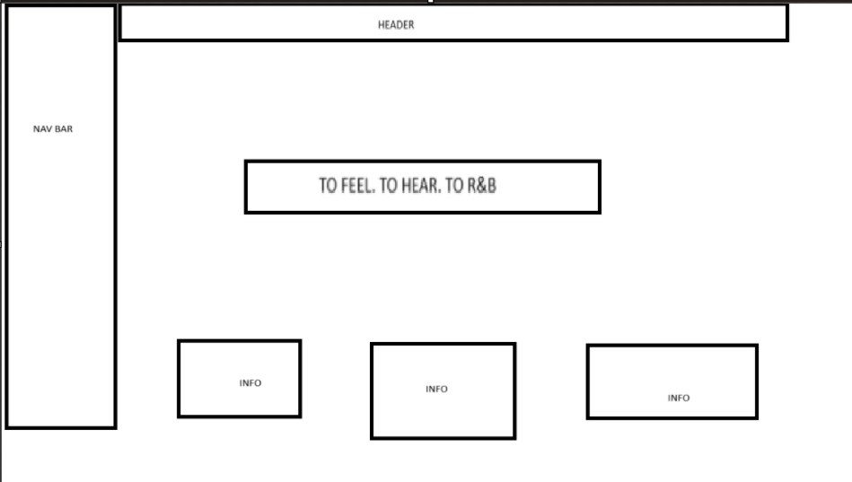
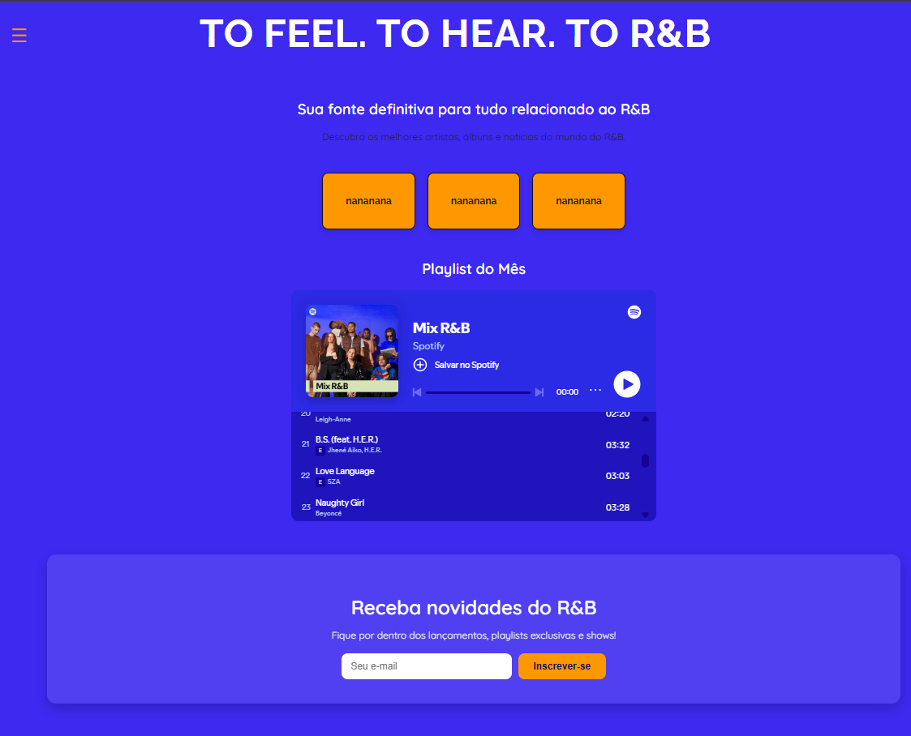

# Trabalho Prático - Semana 03

## Informações Gerais

- Nome: Mirna dos Reis Arcanjo
- Matricula: 833200
- Proposta de projeto escolhida: 
O projeto consiste na criação de uma aplicação web focada no universo do R&B contemporâneo, reunindo informações, imagens e conteúdos sobre diferentes artistas do gênero.
    - Entidade Principal: Artista (ou grupo de artistas de R&B).

    - Entidade Secundária: Álbuns, músicas, playlists, eventos.
- Breve descrição sobre seu projeto:
O projeto To R&B tem como objetivo desenvolver uma aplicação web dedicada ao universo do R&B atual, reunindo artistas, álbuns e conteúdos relacionados ao gênero. O site terá uma identidade visual moderna, com foco em uma experiência imersiva para fãs e interessados em música.

layout-homepage.png

Wireframe

## Print da home-page criada

